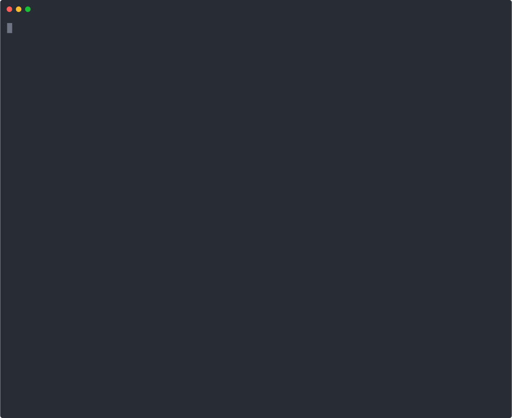

<!--
 Copyright (c) 2023 Anthony Mugendi
 
 This software is released under the MIT License.
 https://opensource.org/licenses/MIT
-->

<!-- 
To generate new recording, run
rm -rf poetry_project && svg-term --out assets/recording.svg --window --command "bash poetry-project.sh -y"
 -->

