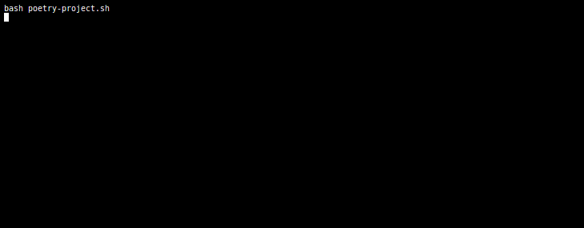
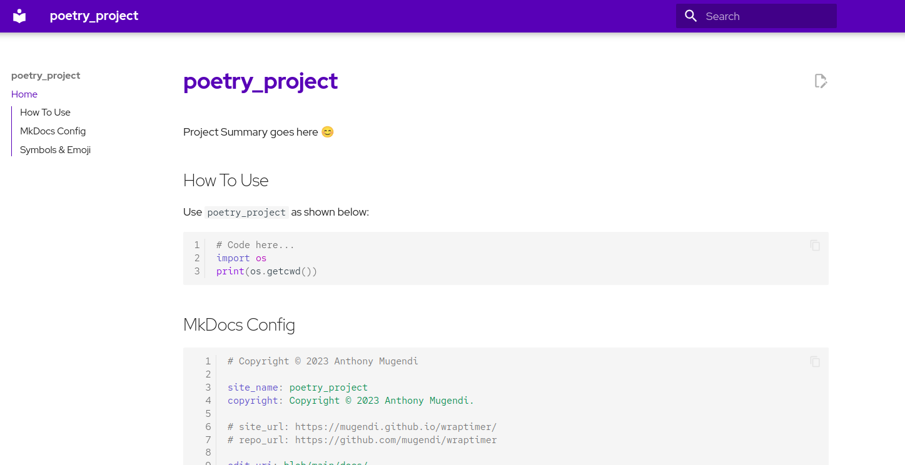

<!--
 Copyright (c) 2023 Anthony Mugendi
 
 This software is released under the MIT License.
 https://opensource.org/licenses/MIT
-->


# poetry-project ⚙️ 💪

[](https://github.com/mugendi/poetry-project-scaffold)
[](https://github.com/mugendi/poetry-project-scaffold)
[](https://github.com/mugendi/poetry-project-scaffold)

<!-- 
To generate new recording, run 
bash record-svg.sh
 -->



[View on Asciinema](https://asciinema.org/a/Q0xFHD4qmmCxuPUFqyUYRcLis)

Poetry is an amazing tool for dependency management and packaging in Python. When used together with other amazing libraries such as [flake8](https://flake8.pycqa.org/), [mkdocs](https://mkdocs-dupe-test.readthedocs.io/) and many others, you can create [Pro Python Projects](https://medium.com/mlearning-ai/how-to-start-any-professional-python-package-project-9f66538ebc2) everty single time. 


This is a bash script that performs simple scaffolding for you and configures all the tools you need based on [This Brilliant Article](https://medium.com/mlearning-ai/how-to-start-any-professional-python-package-project-9f66538ebc2). The only main deviation from the article is that we use `mkdocs` and not `sphinx` coz i find the tooling simpler and better.


## Installation

### Simple Installation
To install on Linux, run the command below:

```bash
curl https://raw.githubusercontent.com/mugendi/poetry-project-scaffold/master/install.sh | bash
```
This simply loads and runs [`install.sh`](./install.sh) Which fetches [`poetry-project.sh`](./poetry-project.sh), saves it in `~/.local/bin` directory. 

If you are not running Linux or do not have the `~/.local/bin` directory, then you can try manual installtion.

### Manual Installation
For non-linux systems, you can attempt the following installation procedure.

1. Clone this repo:  `git clone https://github.com/mugendi/poetry-project-scaffold.git`

2. Navigate to cloned repo dir: `cd poetry-project-scaffold`

3. Copy *poetry-project.sh* : `cp poetry-project.sh poetry-project`

3. Make *poetry-project* executable: `chmod +x poetry-project`

4. Either run *poetry-project* from this directory `./poetry-project` or move it to a folder that is `$PATH` accessible.


## Running

Simply run the **poetry-project** script: `bash poetry-project` 


## Dummy Project



To help you visualize what kind of poetry project is generated, we created a dummy project repo and deployed the documentation (`mkdocs gh-deploy`) without changing anything.

- [View the project](https://github.com/mugendi/dummy-poetry-project)
- [View documentation](https://mugendi.github.io/dummy-poetry-project/)

## PS 

I have documented some of the functions used in this bash script [HERE](./docs/bash-functions.md) mostly because most took a lot of googling to put together and because I would love to re-use most in other projects with ease.

You can have a look too and see if anything there is of benefit to you! 
